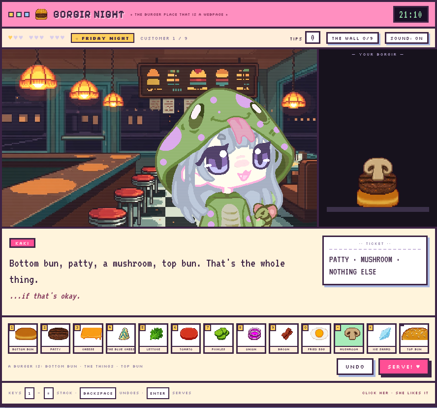
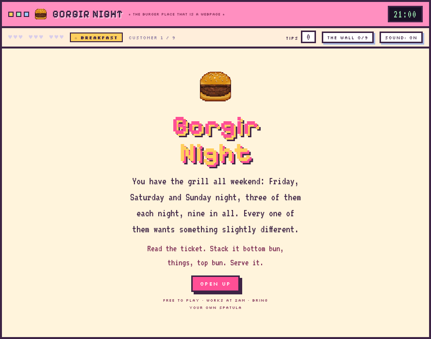
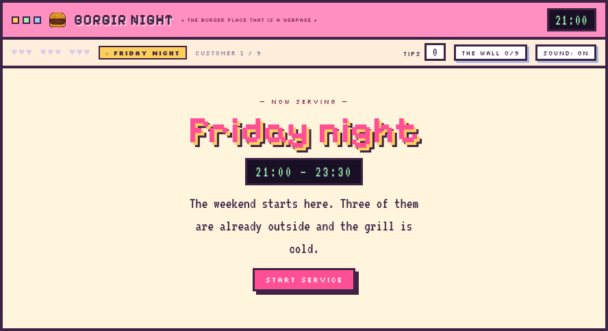
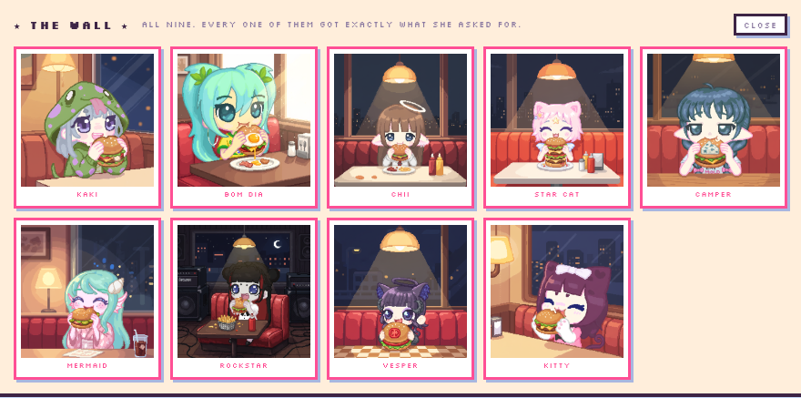

# Borgir Night

### ▶ [Play it](https://dknos.github.io/kaki-burger/)

You have the grill all weekend — Friday, Saturday and Sunday night, three Kakis each night, nine
in all. Every one of them has a slightly different idea of what a burger is. Read the ticket,
stack it, serve it, find out.

Play it in the browser at **[dknos.github.io/kaki-burger](https://dknos.github.io/kaki-burger/)**,
or clone this and open `index.html` — it runs off the filesystem with no server, no network and no
install.



<p align="center">
  
  
</p>

## The wall

Get an order **exactly** right and that Kaki gets her picture on the wall: her, in a booth,
eating the burger you built her. Nine to collect, they stick between nights, and the wall button
in the top bar opens it any time. Click a picture you've earned to see it big.



Each one was made with Vertex image-to-image from her own portrait, so it's her face — with a
detail from her order in it. Vesper's has exactly one thing in it, Star Cat's is taller than she
is, Bom Dia's has the fried egg, and Kitty has stopped crying.

## Poke her

Click any customer. She hops, shuts her eyes and says something. It's a second state machine in
the scene, separate from her reaction to the food, so poking her mid-meal can't confuse the two.

## How it plays

Bottom bun, then the things, then a top bun. Click the rack or use `1-9 0 - =`, `backspace` to
undo, `enter` to serve. She eats it a layer at a time and tells you what she thinks. Three tips
for exactly right, one for close enough, nothing for wrong. Twenty-seven is a perfect weekend, and
your best is remembered.

## The three nights

| | Hours | Who |
|---|---|---|
| **Friday night** | 21:00 – 23:30 | Kaki, Bom Dia, Chii |
| **Saturday night** | 20:30 – late | Star Cat, Camper, Mermaid |
| **Sunday night** | 19:00 – 22:45 | Rockstar, Vesper, Kitty |

The diner art is a night diner, so the service tints it: one keyframed filter scrubbed by a
`--tod` variable leaves Sunday exactly as painted and lifts the room a little on the earlier
nights, so Friday still has some evening left in it. Twenty-seven tips is a perfect weekend.

## The nine tickets

Every order is a different *kind* of puzzle, so the night keeps teaching you something instead of
asking for another list:

| | Who | The puzzle |
|---|---|---|
| 1 | Kaki | an exact order, stated plainly — this is where you learn the bun rule |
| 2 | Star Cat | a shape, not a recipe: "taller than me" means six things, contents free |
| 3 | Vesper | a count, not a list: **exactly one** thing between the buns. Two is a heap |
| 4 | Rockstar | an adjective to decode. "Loudest" is onion, pickles, bacon |
| 5 | Mermaid | asks for something from the sea. There is no sea. She amends it herself |
| 6 | Chii | changes her mind three ingredients in, and apologises the whole time |
| 7 | Bom Dia | breakfast, at ten at night, on purpose |
| 8 | Camper | asks for **the blue cheese**, eats it, and says "I would never eat mold." Her shirt says so too |
| 9 | Kitty | "the one my friend had" — the first order of the weekend, two nights ago |

Four of them soften the order with an "...if that's okay" a beat later. Star Cat, Vesper, Rockstar
and Mermaid do not, because they wouldn't.

Vesper hovers rather than bobs, and something catches the light over her head every few seconds.
She has a halo and a pair of wings; she is not going to sit there like the rest of them.

Kitty's tears are a separate slice of her portrait, so when you get hers right they actually fall
and stop.

## How it's put together

**The burger is one static scene.** Eight image slots all page the same ingredient atlas: the host
writes `--sN` (which cell) and `--yN` (where it sits), and any burger you can build falls out of
that. A Popkorn scene can't grow nodes at runtime, so the stack is eight pre-declared slots parked
off-stage until they're needed.

**The customer is one scene per character**, machine-driven. The page fires `eat`, `happy`, `meh`
or `sad`; the scene owns what those look like — half-lidded chewing, a happy squint, a heart that
pops, tears that fall. Nothing about the game rules lives in the scene.

**The art was generated for it.** The diner and the twelve ingredients came from Grok Imagine, then
`slice_art.py` keys the flat magenta backdrop off the ingredient sheet, trims each one, and packs
them into a single atlas on the same pixel grid as the diner, so everything shares one pixel size.
The nine characters are cutouts sliced from single flat portraits.

**Sound is synthesised**, four oscillator blips, no audio files.

## Build

The originals the build reduces (`raw/`) aren't in the repo; `art/` holds what the game loads.

```bash
python3 slice_art.py     # raw/ -> art/ingredients.png (atlas) + art/diner.png
python3 gen_scenes.py    # -> scenes/burger.css + scenes/cust-*.css
python3 build.py         # -> index.html
python3 build_lab.py     # -> lab.html
```

`orders.py` holds the whole script: who comes in, what they want, and every line they say. Change
a rule there and the game changes; nothing about the tickets is hardcoded in the page.

## Notes

- **Bom Dia's background came off by hand.** A version of her portrait with the
  backdrop already removed was supplied, so `bg_mask` uses its alpha instead of
  flooding: the flood could only reach background it could walk to from the
  border, and the pockets it could not reach were still stuck to her — a teal
  blob beside her hair and a scatter of green. The mask is that cutout scaled to
  her frame; her own pixels are untouched.
- **Camper needed a different background cut.** Hers is a painted gradient with 130 colours in it,
  so the palette flood found almost nothing (16% of the frame). `walk_tol` floods from the border
  by *local* colour distance instead — it follows a gradient and stops at her outline.
- The blue cheese was generated on its own rather than on the 4x3 sheet, and the keying now
  takes its key colour from the image's own corner: the generator doesn't return the exact magenta
  it was asked for, and a hardcoded `#FF00FF` missed by enough to leave the whole backdrop in.

- **The closed eyes were rebuilt** (see `../kaki-studio/cast_slice.py`). Finding the eye as "the
  darkest connected mass" left half of the big pale irises behind, and an inscribed-ellipse trim
  clipped Rockstar's heavy black rim so her lid was drawn inside an eye that still looked open. It
  is now the dark rim, morphologically closed and filled, with the lid drawn as one tapered arc
  rather than traced from the eye's own jagged silhouette.

- **Everyone stands in the same place, measured.** Each portrait fills its 300×300 frame
  differently, so a fixed offset left some of them hovering with a visible cut edge and pushed
  others off the side. `place()` reads each sprite's alpha box and lands her feet four pixels past
  the bottom of the frame, every time.
- **An animated channel outranks a state.** The happy squint never appeared at first, because the
  same node carried a blink animation on `opacity` — the animation wins over both the base value
  and the state rule. There are now two nodes on the same shut artwork: one blinks, one is held by
  the state. Worth remembering; it is the second time this trap has cost a bug.
- **The parser unescapes `\n \r \t \" \\` and nothing else.** A `\u2665` in a `content:` string
  reaches the canvas as the literal text `u2665`. Emit the character itself.
- **Mermaid needs her own script** (`fix_mermaid.py`), and it took four attempts. Her artwork sits
  inside a drawn picture frame, and that frame walls her backdrop off from the border flood, so it
  never gets removed. Her backdrop is also vertical stripes in three colours she also wears, so a
  colour flood seeded inside the frame walks into her hair and eats holes out of it; a directional
  scan avoids that but the white stripe runs straight into the white shell in her hair. What works:
  drop every pixel wearing a stripe colour, then fill back whatever turns out to be *enclosed* by
  her — her face and hair highlights come back, the backdrop doesn't. The shell was already half
  taken by the original border flood before this script runs, so it is restored from the source by
  its own colours inside its own box.
- The generated sheet drew a whole small burger where a top bun was asked for, so `slice_art.py`
  keeps the top 56% of that cell and throws the rest away.
- Serving locks the rack until the next customer arrives, which is why a fast clicker can't drop
  ingredients into a stack that's already been eaten.
- Verified by playing the whole weekend headlessly: nine for nine, every verdict correct, including
  Chii's mind-change (which needs an undo) and Kitty's callback to the first order.

### Blinking

Four lids per eye, all cut from her own art, because two made every reaction in
the game look like the same reaction.

| state | what it is | when |
|---|---|---|
| `half` | squashed to 72%, barely lowered | chewing |
| `meh` | squashed to 42%, a slot of eye left | unimpressed |
| `shut` | painted out, lash bowed **up** | pleased, poked, blinking |
| `sad` | painted out lower, lash bowed **down** | miserable |

And two mouths, because a smile under a shut eye reads as pleased whatever the
lids are doing: a flat line for unimpressed and a downturned arc for miserable.
Chewing and pleased keep the mouth she was drawn with. `mouth_box` in cast.json
is hand-read; auto-detection kept finding her chin or her collar.

- **shut** and **sad** paint the eye out with the most common face colour in a
  ring around *that* eye, then draw one arc for the lash. The ring grows until it
  has found enough face in it: a tight ring around an eye with a fringe over it is
  nearly all hair, and Bom Dia's closed left eye came out filled with the green of
  her own fringe. `span: true` fills a blob out to its own silhouette, which is
  how Bom Dia stopped wearing a wedge of her own fringe on a closed eyelid: a
  strand crossing an eye is not enclosed by the rim, so hole-filling leaves it
  out of the blob.
- Every blob is grown two pixels past the eye before any of that. A lid is a
  separate layer, and when the renderer draws it at a fractional scale — a
  browser at 125% zoom — its alpha edge blends with whatever is underneath.
  Sitting exactly on the eye's outline, that underneath is the dark rim, and the
  blend traces a thin ring around every closed eye. Two pixels of margin puts
  the edge over face, where both sides of the blend are the same colour.
  Transparent pixels also carry the artwork behind them rather than black, for
  the same reason.
- **half** and **meh** do not cut the eye down. They squash it into the bottom of
  its own socket, nearest-neighbour on the row map. The first version cut the top off and
  filled it with skin, and it was wrong on all eight faces at once: a flat cut
  destroys the rim the artist drew across the top of the eye, so what is left
  reads as a chopped blob. Squashing resamples those pixels, so the rim, the iris
  and the highlight all survive and the rim lands where a lowered lid's edge
  belongs.

Vesper's eyes are named rather than detected. She is painted rather than lined —
her rim is a soft gradient that runs into her eyeshadow and her hair — so every
threshold either missed half the eye or swallowed the box. `eye_ellipse: true`
takes the hand-read box as an ellipse and hands it to the same fill and the same
lash arc, which do not care where the mask came from.

She also arrived with a real alpha channel rather than a painted backdrop, so
`bg_exact: true` keys her background by colour instead of flooding from the
border: a flood leaves whatever it cannot reach, which on her is the hole inside
her halo.

## Editing a frame by hand

Everything above is generated, and generating expressions keeps getting things
almost right. `paint.html` is the escape hatch.

1. Open `paint.html` (it works straight off the file, no server).
2. Pick a character and a state. `idle` is her own art and shows in every state;
   the other four only show for that reaction.
3. Draw. The palette is the colours already in that frame. Pen, bucket,
   eyedropper, eraser, undo, revert.
4. **export png** drops `<key>__<state>.png` in Downloads.
5. `python3 apply_paint.py` diffs it against what the scene draws now and keeps
   only the changed rectangle, then rebuild.

Every asset is inlined as a data URI in that page on purpose: reading pixels out
of a canvas is blocked when the image came from a `file://` URL, so a paint tool
that loaded its art the normal way would open, look fine, and refuse to export.

Camper's eyebrows went in this way — see `draw_brows.py`, which writes an export
in the same shape and goes in through the same door.

## The look

A 16-bit pastel geocities cabinet: a scrolling marquee, a pink window title bar
with a green LCD clock, hearts for the nine tickets, a torn receipt for the
order, an under-construction footer with 88x31 badges and a hit counter.

It came in as a `.dc.html` artifact with its own 69KB runtime and no Popkorn in
it at all, so the look was ported into `build.py` rather than adopted whole —
the stage is still Popkorn, the content still comes from `orders.py`, and only
`art/tile-sky.png` was taken from the zip. Its `assets/` was a snapshot from
several rounds earlier and copying it would have silently reverted the eyes,
the mouths and Camper's eyebrows.

`build.py` now fails rather than shipping if the markup loses a hook the script
holds on to. Two of those are class selectors used inside a `forEach`, so
dropping one in a restyle throws on null at the first service card instead of at
load, which no screenshot would catch.

Fonts are self-hosted in `fonts/` (SIL OFL, see NOTICE.md); the page makes no
third-party requests.

## Credits

Made by [@dknos](https://github.com/dknos).

The Kakis are **KemonoKaki** characters, drawn on [oekakiconnect.net](https://www.oekakiconnect.net/).
The diner, the ingredients and the nine pictures on the wall were generated for this; everything
else in here is hand-written.

Popkorn is MIT, © ayaz — see `vendor/POPKORN-LICENSE.txt`. The three typefaces in `fonts/` are SIL
OFL — see `NOTICE.md`.

The share card is rendered from the game rather than assembled separately, so
the character stands where she stands at the counter: `python3 make_og.py`
screenshots the stage at its native 640x360, drops the top of the frame to reach
1.9:1, and doubles it with nearest-neighbour. No fractional scaling anywhere.
